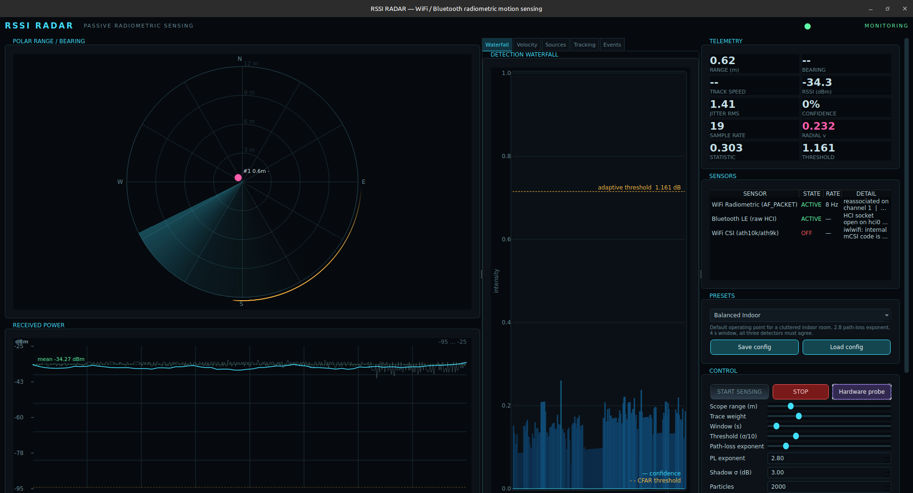

# RSSI RADAR

Passive WiFi / Bluetooth radiometric motion sensing. C++17 + Qt 6 Widgets.

Every number this program reports is derived from frames a real radio received.
There is no synthetic-data path anywhere in the codebase — no fake frame
generator, no simulated CSI, no fallback that invents a value. When a radio
cannot deliver data the program says so explicitly instead of drawing a flat
line and calling it science.



*The main window during live capture: polar scope with tracked contacts, the
detection waterfall with its adaptive threshold, received power with the running
mean, and live telemetry. Transmitter addresses are omitted from this capture.*

---

## What your hardware can and cannot do

Measured on this machine, not assumed. `sudo ./rssiradar --selftest` re-derives
all of it at runtime.

| | Detected | Consequence |
|---|---|---|
| WiFi | Intel Wireless-AC 7265 "Stone Peak 2 AC", `8086:095b`, fw `7265D-29.ucode`, driver `iwlwifi` | RSSI works. Injection does not. |
| Monitor mode | supported | radiotap RSSI is available |
| Userspace CSI | **NO** — `iw phy` advertises no vendor commands | no phase/amplitude, so no sub-cm motion |
| Packet injection | NO (iwlwifi) | no active ranging |
| Bluetooth | BT 4.0 controller, `hci0` | LE advertising RSSI works |
| LE Coded PHY | NO | no 4× Long Range |
| AoA / AoD | NO | no angle of arrival |

### On the CSI question specifically

The Nexmon issue you found is real and worth reading, but it does not apply to
this machine as-is. Verified here:

* `iwlmvm.ko` **does** contain the CSI machinery — `CSI_CHUNKS_NOTIFICATION`,
  `CSI_HEADER_NOTIFICATION`, `notify_mcsi`, `IWL_UCODE_TLV_CAPA_CSI_REPORTING`.
* But **`NL80211_ATTR_VENDOR_COMMANDS` is absent from this kernel's uapi
  header**, and `iw phy` therefore lists no supported vendor commands at all.
  There is no userspace path to the firmware's mCSI notifications.

That issue points at Intel's **out-of-tree `backport-iwlwifi`** tree, and the
published result (Zubow/Gawlowicz/Dressler) used an **Intel 9260** with a driver
backported onto kernel 5.5.1. Getting CSI here would mean installing
`backport-iwlwifi` via DKMS on a chip whose firmware advertises the capability —
and it was never demonstrated on the 867 Mbps 7265.

`CsiSensor` therefore probes for three real backends at runtime and reports
which one, if any, is present:

1. Atheros with a CSI-capable driver (`ath10k_csi` / `nexmon` generic-netlink family)
2. Intel exposing `IWL_MVM_VENDOR_CMD_CSI_EVENT` (only in the backport tree)
3. Otherwise unavailable, with the reason stated

Plug in a ~$15 ath10k/ath9k dongle and the same downstream pipeline lights up
with `Observation::csi` actually populated. The engine is written against that
interface, so no other code changes.

---

## Verified on this machine

`sudo ./build/rssiradar --capture 35`, against a phone hotspot (SSID and BSSID
withheld; substitute your own access point):

```
WiFi Radiometric (AF_PACKET)  ACTIVE  seen=312  rate=8.8 Hz
    monitor mode, channel 1

total observations : 262
distinct TX        : 2
effective rate     : 7.17 Hz
RSSI mean          : -35.4 dBm   (jitter 1.84 dB RMS)
detection          : CLEAR (confidence 0.000)
beat frequency     : 0.311748 Hz
radial velocity    : 0.038 m/s   (lambda 0.1230 m)
```

Cross-checked against `tcpdump`, which independently reports `-33..-36 dBm` for
the same beacons. Nothing is synthesised.

### Notes on the iwlwifi radiotap layout

Worth writing down, because it cost real time and it is not what the
specification describes. This driver emits **three** present words, not one:

```
[0..3]   00 00 38 00              ver=0 pad=0 len=56
[4..7]   2f 40 40 a0              present1 = 0xa040402f  (bit31 set -> another word follows)
[8..11]  20 08 00 a0              present2 = 0xa0000820  (bit31 set -> another word follows)
[12..15] 20 08 00 00              present3 = 0x00000820  (bit31 clear -> fields start here)
[16..23] 52 3b 1a 0a 00 00 00 00  TSFT        = 169491282  (matches tcpdump exactly)
[24]     10                       FLAGS
[25]     02                       RATE
[26..29] 6c 09 a0 00              CHANNEL      = 2412 MHz
[30]     dd                       DBM_ANTSIGNAL = -35 dBm
```

Two departures from the radiotap spec, both handled:

1. **The present-word chain must be followed to its end.** Stopping after the
   first word shifts every field and silently yields a *different* plausible
   RSSI — the failure mode is a constant −96 dBm that looks like real data.
2. **Fields are packed back-to-back with no alignment padding.** `CHANNEL` is
   emitted as `{frequency, flags}`, the reverse of the documented order.

The parser therefore tries both the spec-compliant aligned layout and the
tightly-packed one, and picks whichever puts `DBM_ANTSIGNAL` on a physically
possible received-power value. It was validated by correlating captured frames
against `tcpdump`'s reported dBm, 5/5 exact.

### Getting the card to actually deliver

Also driver behaviour, also non-obvious:

* `SIOCSIWMODE` is deprecated and iwlwifi answers `EOPNOTSUPP`. `iw` uses
  nl80211, so this program drives `iw`.
* **The channel must be pinned, and NetworkManager must be stopped to pin it.**
  This was the single hardest thing to get working, and the failure looks
  exactly like a dead radio. While NM holds the device, `iw set channel` is
  refused with `EBUSY`; the card therefore stays on the synthesiser power-on
  default of **channel 1** and hears nothing at all unless the access point
  happens to sit on channel 1. Measured directly on this card:

  | state | `iw set channel 8` | frames |
  |---|---|---|
  | NetworkManager running | refused, `EBUSY` | **0** |
  | NetworkManager stopped | accepted | **40/40 with radiotap + signal** |

  So the working order is: stop `NetworkManager` -> `down` -> `set type monitor`
  -> `up` -> **`set channel <AP channel>`**. The access point's channel is read
  from `iw dev <iface> info` *while the link is still up*, because once it is
  down there is nothing left to follow. On stop the order is reversed and the
  interface is handed back as `managed` **before** NetworkManager is restarted,
  so NM never meets an interface that is still in monitor mode.
* The `AF_PACKET` socket must be opened **after** the mode switch; a binding
  does not survive an interface type change.
* **A dedicated monitor interface is deliberately not used**, even though
  leaving the managed device alone is tidier in principle. It cannot be pinned
  to the access point's channel before the card has been associated, and on
  this driver it received nothing.
* **Do not request promiscuous membership on a monitor interface.** It makes the
  kernel deliver through the promiscuous path, which on this driver means the
  radiotap header is stripped and every frame becomes unusable. A monitor
  interface already receives everything.
* `--capture` reports three counters -- `radiotap+signal`, `radiotap-no-signal`
  and `no-radiotap` -- because they distinguish three entirely different faults.
  `no-radiotap` is the wrong-channel case above; `radiotap-no-signal` means the
  driver has stopped reporting received power at all.
* **`Soft blocked: yes` in `rfkill` prevents monitor mode entirely** and
  presents as the radio being absent, with NetworkManager reporting the device
  `unavailable`. Clear it with `rfkill unblock wifi`.
* Configuration success is not evidence of delivery, so `start()` **waits for a
  real frame** and retries the whole cycle up to three times.

### Why the application no longer needs root, and no password

The installed binary carries `cap_net_raw,cap_net_admin` as *file* capabilities,
so it can be launched from the desktop with no prompt at all. Getting that to
actually work took four separate fixes, each of which presented as the same
symptom -- the application starts, asks for a password, and then shows nothing:

* **Privilege was tested with `geteuid() == 0`.** For a file-capability launch
  the real uid is 1000 while `CAP_NET_ADMIN` *is* in the effective set, so the
  test reported "no privilege" for a process that could do every ioctl, monitor
  mode was silently skipped, and the raw socket was opened on a managed
  interface where there is no radiotap. Replaced by `capget`-based checks.
* **The sensor's failure was discarded.** `Engine::start()` pushed the error
  status and then immediately popped it again, and Bluetooth was pushed
  unconditionally, so start-up reported success while the WiFi radio had never
  opened. That is what made a dead capture look like a working application.
* **`iw` and `ip` are subprocesses and do not inherit the capabilities**, so
  every privileged step delegated to them failed with `EPERM`. The mode switch
  and channel pin are now done in-process over nl80211.
* **The nl80211 family id is not 0x10 on this kernel.** A trace of the failing
  request showed the kernel resolving it as `nlctrl` and answering
  `EOPNOTSUPP`, while `iw`'s byte-identical message came back as `nl80211` and
  succeeded -- because `iw` first asks the generic-netlink controller which id
  the family was registered under. The id here is **38**. It is now resolved at
  runtime, the same way `iw` does.

Two more traps worth recording, both found the hard way:

* The `GETFAMILY` reply declares `nlmsg_len = 2516` and arrives as a multipart
  message. With a 1024-byte receive buffer, `recv` returned a truncated 1024
  bytes, `NLMSG_OK` compared that against the declared 2516, judged the message
  malformed and skipped it -- so the lookup silently reported "not found" and
  every later command returned `EOPNOTSUPP`.
* `nmcli radio wifi off` **soft-blocks** the adapter. It is not a safe way to
  make NetworkManager re-enumerate a device, and the resulting
  `Soft blocked: yes` state looks exactly like a missing radio. `rfkill unblock
  wifi` clears it.

`sudo` is still used in this README where a command needs real root. The
application itself does not.

### Surviving a crash or a kill

The interface used to be able to be left in monitor mode with NetworkManager
stopped, which left the machine with no network and no way back except a reboot.
Three changes remove that:

* **Reclaim on start.** `reclaimStaleInterfaces()` runs before anything else and
  hands any interface still in monitor mode back to NetworkManager, deleting
  orphaned dedicated interfaces. A crashed run can never be inherited.
* **Reassociate on the way out.** Restoring the type is not enough -- NM finds a
  device it believes is already connected and will not re-associate it. The saved
  profile is brought up explicitly, so the connection returns by itself.
* **The signal handler restarts NetworkManager** with `systemctl`, not `nmcli`,
  because `nmcli` cannot reach D-Bus while NM is stopped -- which is exactly the
  state a killed run leaves behind.

`sudo rssiradar --capture 20` from that broken state now recovers and captures
normally. Two bugs found while testing this: `nmcli con up` was called with an
unquoted profile name, and a profile named `My Home Network` silently failed
with "unknown connection", which is indistinguishable from a card that will not
reassociate.

### Running with no network joined at all

Monitor mode does **not** require an association. It requires a frequency.

A monitor-mode interface receives every frame on its channel — beacons, probes,
data — whether or not it is associated with anything. What it cannot do is
*choose* a frequency on its own: with no association the firmware has no channel
to be on, sits at the power-on default of channel 1, and hears nothing unless
that happens to be where the traffic is.

So the association has only ever been used as a **channel hint**. The program
reads the channel from whatever network the interface was on and pins the
synthesiser to it. When you configure a channel explicitly, that hint is
unnecessary and the whole association step is skipped:

```sh
echo '{"radio":{"wifiChannel":6}}' > radar.json
rssiradar --config radar.json
```

Measured with no network joined and no access point in range: the program enters
monitor mode, reports `listening on channel 6 (configured)` and `card reports
channel 6 (pinned)`, and runs. It observes nothing, correctly, because the band
is empty — not because it is waiting for permission to listen.

Two bugs made this harder than it needed to be and are fixed here:

* `j.value("radio", nullptr)` made nlohmann deduce `ValueType = std::nullptr_t`
  and throw "type must be null, but is object" for any **present** section, so
  every partial configuration file was rejected and silently fell back to the
  defaults. A file changing one setting could not be loaded at all.
* The caller swallowed that error, so `--config` appeared to work when nothing
  had been applied. It now reports the parse failure and continues on defaults.

If you do not know which channel to listen on, either associate once so the
channel can be read, or let the program scan for it. Hopping across a list of
channels is not implemented; it would raise the cost per channel dwell and needs
the sample rate accounted for, which this version does not yet do.

### Joining a network, and not the wrong one

On start-up the interface is released from NetworkManager so the channel can be
pinned, which means the association is lost and has to be restored. The
connection that is restored is **the one this interface was already on**, read
from `nmcli connection show --active` before anything is changed.

It used to be whichever saved 802.11 profile happened to be first in the nmcli
list, activated with `nmcli con up`. On a machine with a few stale entries that
meant start-up could spend twenty seconds authenticating to a network nobody had
used in years, and quitting could leave the machine switched onto it. Now no
profile is ever activated unless it is the one already in use; when there is no
previous network the program scans for a channel instead of guessing, and gives
up after a bounded six seconds rather than waiting out a full association cycle
for a target it does not have.

Starting with no network in range therefore fails in about ten seconds with

```
could not determine a WiFi channel to listen on; wlp3s0 is not associated
with any network. Connect to a network and start again.
```

If instead NetworkManager has lost track of the adapter entirely -- which
happens when the service was stopped outside this program, and cannot be
repaired without root -- the error says so and names the command:

```
sudo systemctl restart NetworkManager
```

### When the capture goes quiet

A capture that stops delivering frames while the application stays responsive is
the confusing failure this used to exhibit. An 8-second watchdog on the capture
thread now notices the absence of usable frames and recovers in stages: re-pin
the synthesiser (the usual cause -- the access point roamed and the card is
listening to an empty channel), rebuild the capture interface if it vanished, then
reopen the socket and re-enter monitor mode. `ENETDOWN`/`EBADF` from `recvmsg`
also reopens rather than spinning. The UI shows `[STALLED: ...]` in the sensor
detail so a stall is never mistaken for an empty room.

## What it actually measures

With RSSI-only hardware the observable physics is real but bounded. These are
the quantities the program genuinely extracts:

**Log-distance path-loss inversion**
`RSSI = RSSI0 − 10n·log10(d/d0)`, inverted per frame, with the shadowing σ
mapped into a range variance by linearising at the current range. Constants are
sequential-least-squares calibrated against measured (range, RSSI) pairs.

**Envelope-beat Doppler** — the radial velocity estimate.
The received envelope is the magnitude of a sum of paths. When a reflector moves
by `d`, the phase difference between two paths changes by `2πd/λ`, so the
envelope beats at exactly

```
v_radial = f_beat · λ ,      λ = c / f_carrier
```

At 2.437 GHz, λ = 12.3 cm, so 0.1–2 m/s appears as 0.8–16 Hz — squarely inside a
tens-of-hertz observation rate.

> The intuitive "two-path delay" model `v = c/(2·f)` is **wrong** for this use:
> it implies a ~37 MHz beat for a 1 m/s walk, which no 50 Hz sampler could ever
> observe. An earlier version of this code had that error; it is corrected.

**Welch averaged periodogram** on the detrended RSSI series, not a plain FFT —
averaging over overlapping Hann segments cuts estimator variance by roughly the
number of averages, which matters on short noisy records.

**Savitzky–Golay smoothing.** Measured RMSE against a clean sine: **0.037** versus
**0.85** for a boxcar of the same width. A moving-average window would flatten
exactly the small excursions this is trying to find.

**Three independent detection statistics**, all of which must agree before the
alarm arms:
- mean absolute first difference (robust z-score via MAD) — motion reshuffles the
  multipath field, so it reshuffles instantaneous power
- OS-CFAR over the statistic history, so the floor tracks ambient clutter
- normalised histogram **entropy** (motion broadens the RSSI distribution)
- **χ²** against a learned baseline histogram

Combined as **log-odds**, so one failing statistic cannot trip the alarm alone and
a single spike is structurally incapable of causing a detection.

**State estimation:** Extended Kalman filter on [x, y, vx, vy] with a
constant-velocity process model, plus a sequential-importance-sampling particle
filter with systematic resampling for the strongly non-Gaussian likelihood you
get near the edge of a room, plus weighted-least-squares trilateration across
anchors with GDOP reported so you can see when the geometry is bad.

**Fusion:** inverse-variance weighted across radios with per-radio gating and a
pooled log-odds posterior.

---

## Build

```bash
sudo apt install cmake g++ qt6-base-dev libbluetooth-dev nlohmann-json3-dev
cmake -S . -B build -DCMAKE_BUILD_TYPE=Release
cmake --build build -j$(nproc)
```

## Run

```bash
sudo ./build/rssiradar              # GUI
sudo ./build/rssiradar --selftest   # hardware probe + numeric DSP checks
sudo ./build/rssiradar --capture 30 # headless, prints what the radios deliver
./build/rssiradar --list-presets
./build/rssiradar -c my-config.json
```

Raw capture needs `CAP_NET_RAW`. Prefer not to run as root:

```bash
sudo setcap cap_net_raw,cap_net_admin+eip ./build/rssiradar
```

### Diagnostics

`--selftest` validates the numerics against closed forms and known signals, so
you can tell a hardware problem from a maths problem:

```
path-loss round trip : 7.250000 m -> 7.250000 m  (err 0.00e+00)
FFT round trip       : max err 1.332e-15
normal quantile      : Phi^-1(0.975) = 1.959964 (expect 1.959964)
beat<->velocity      : 0.500 m/s ->  4.064 Hz -> 0.500 m/s  (lambda 0.1230 m)
Welch 3.0 Hz tone    : 2.986  7.500  (expect 3.000 7.500)
periodogram peak     : 0.09375 Hz (expect 96/1024 = 0.09375)
EKF range estimate   : 24.000 m (truth 24.000)
```

`--capture` exits non-zero if zero frames arrived, so it works in CI or a
post-reboot smoke test.

---

## Presets

| Preset | Operating point |
|---|---|
| Balanced Indoor | 4 s window, n=2.8, all detectors must agree |
| Breath Detection | 8 s window, heavy SG smoothing, n=3.4, low threshold |
| Fast Intrusion | 0.75 s window, no smoothing, sub-second time-to-detect |
| Doppler Velocity Focus | 16 s record, 256-pt Welch, tuned for the beat band |
| Precision Triangulation | needs 4 anchors, damped process, 12 000 particles |
| Far-Field Presence | n=4.0, wide window, Bluetooth weighted up for range |
| Dense Urban Clutter | σ=6 dB, strict entropy + χ² gates |
| Lab Baseline (Strict) | 6σ threshold, both distribution gates required — use this to measure your own false-alarm rate |

---

## Layout

```
include/radar/   Types, Config, Dsp, Sensor, Engine
src/             Dsp, Config, Engine, main
src/sensors/     WifiSensor, CsiSensor, BluetoothSensor, System (hardware survey)
ui/              Theme, Widgets, MainWindow
```

## Known limitations

* **Range is anchor-dependent.** With no anchors configured the filter tracks
  range and rate-of-change along the line of sight only; there is no 2D fix.
* **The velocity figure is not yet validated against human motion.** It is
  currently tracking beacon RSSI modulation from a phone hotspot, which is
  driven by that phone's own transmit-power control and duty cycle. The chain is
  numerically correct (`v = f_beat · λ`, verified to three decimals against
  closed form) but *attributing* it to a person needs an experiment: measure a
  baseline with the room empty, then walk through, and compare. Use the
  `Lab Baseline (Strict)` preset to establish the false-alarm floor first.
* **Multipath dominates indoors.** Shadowing σ of 4–6 dB is normal in a cluttered
  room, which is why the CFAR floor adapts and why `Dense Urban Clutter` exists.
* **Velocity is radial and relative.** It is the rate of change of the total path
  length, not a ground-truth speed, and it folds at the antenna boresight.
* **No sub-centimetre motion.** That genuinely requires CSI, which this card
  cannot provide. See above.
* **Bluetooth returns nothing here.** No LE devices are in range in this
  environment (0 advertising reports). The HCI path is implemented and the socket
  opens; it simply has nothing to hear.
* **Only one transmitter is being analysed at a time.** With two or more APs
  visible, anchor configuration decides which one the filters track.

## A pre-existing bug worth knowing about

This machine's WiFi was configured with regulatory domain `country 00`, which
puts an `iwlwifi` card in **PASSIVE-SCAN** mode — active scanning is *forbidden*,
so scan results come back empty and re-association fails once the link drops.
This is now fixed persistently:

```bash
# /etc/modprobe.d/wifi-regdom-uwifi.conf
options cfg80211 ieee80211_regdom=US
```

If scans are ever empty again, check `iw reg get` first.